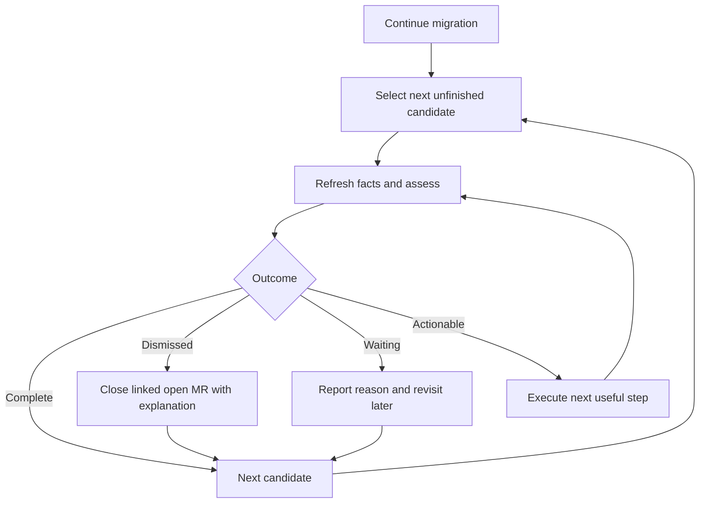
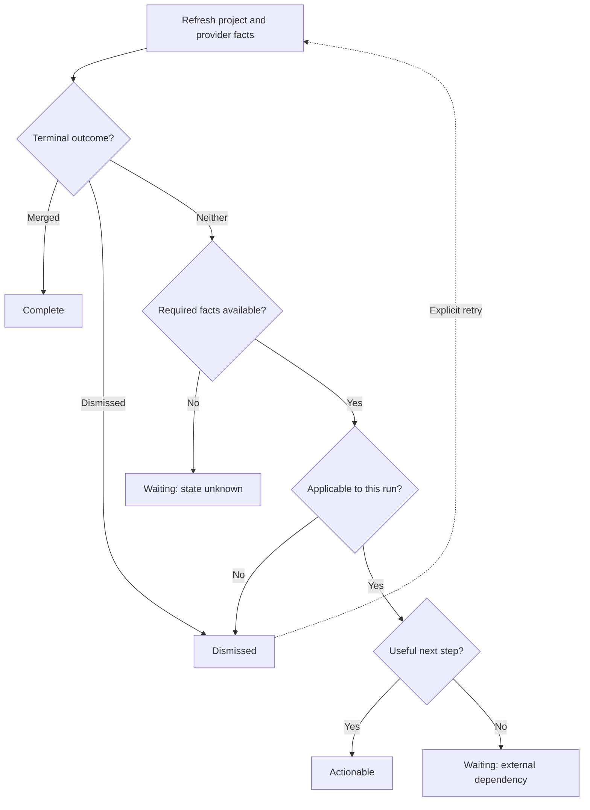
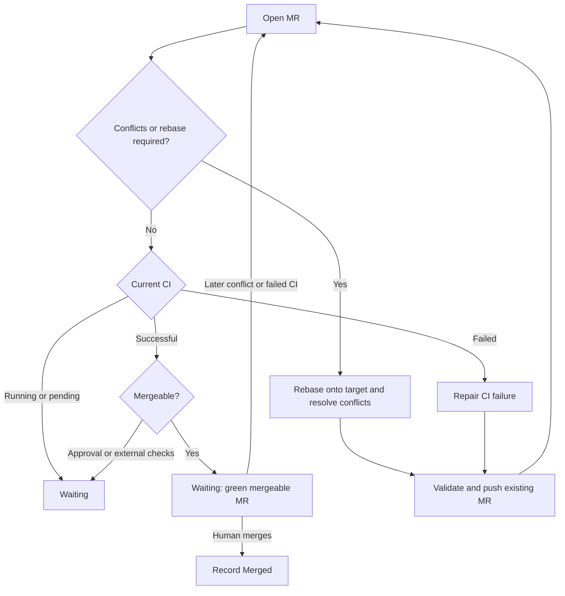
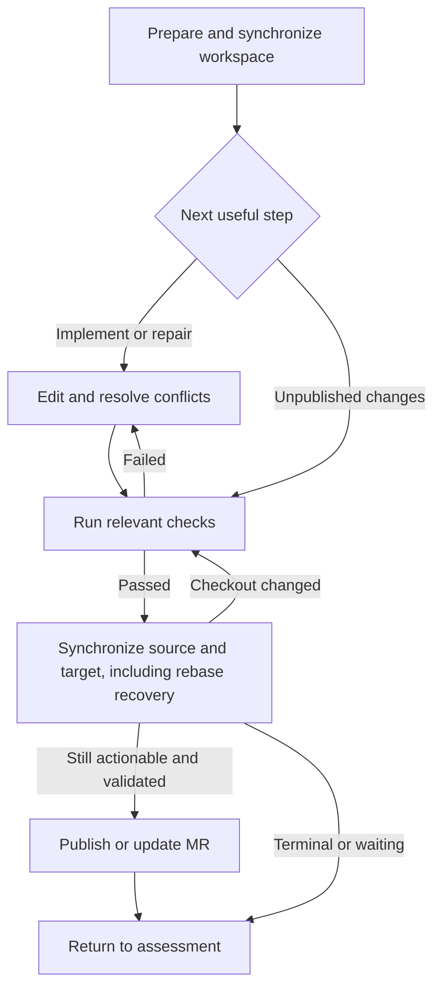

# OMNIBOARD migration workflow

## Four-outcome workflow

Every agent and environment uses the same workflow. Progress labels describe
implementation milestones; the computed workflow decision controls the next action.

| Outcome | Meaning | Next action |
| --- | --- | --- |
| Complete | The migration is merged | Stop; leave retained local edits untouched |
| Dismissed | The migration is no longer required | Stop; close any linked open MR with an explanation |
| Waiting | No useful work can proceed now | Report the reason and continue another project |
| Actionable | The agent can advance delivery | Prepare, implement or repair, validate, and publish |

`progress.workflow` contains `outcome`, `reason`, and `instruction`. The API
and app share the pure decision function. MCP consumes that decision rather than
reinterpreting progress labels. It checks fresh MR facts before checkout operations. No database column, enum change, or SQL migration
is required. Existing milestone snapshots remain milestone history; they cannot
reconstruct historical waiting/actionable outcomes.

### Continue loop

`continue` selects pending projects first, started/published work second, and
failed/blocked/needs-input/pending-retry work third, smallest source size first
within each group. Explicit status filters override that ordering. Complete and
dismissed records are excluded, including when a status filter includes done.
Waiting, stopped and failed preparations do not consume the actionable batch limit.
An empty batch is not proof that all migrations merged.

### Assessment

Merged evidence takes precedence over local files and old progress labels.
Dismissed is terminal until an explicit retry clears the resolution through the
existing retry endpoint. A progress report cannot reopen a terminal migration or
replace its MR. A done record without a resolution waits for clarification; it is
not automatically treated as merged.

No recorded MR is normal for new work. A failed lookup of a recorded MR, or failed
discovery, leaves required provider facts unknown and prevents migration work.
The existing reconciliation policy determines applicability for recorded work;
a changed analyzer result alone does not override a confirmed merge. Fresh
projects must match the configured target. Explicit retries are reassessed.

Agent work ends when an open MR has successful CI and is mergeable. Keep the
existing mr_created milestone and return waiting/merge_request_ready; merging
belongs to the user or consuming team. Running or pending CI also waits. Failed
CI becomes repair work when no newer pipeline is running. Conflicts or a required
rebase remain actionable even with green CI: rebase onto the target branch,
resolve conflicts, validate and push the existing MR. Approval and external
blockers wait. Infrastructure-only CI failures retain their external-blocker
classification. Waiting preparation never touches a retained checkout or creates
new work by rebasing an already-green MR.

### Inside actionable

Always call preparation before editing a retained checkout. Only a continue
result with a workspace permits migration work. Preparation reuses compatible
local edits or recreates disposable state from the remote branch/current target.
Use finalization for publication; do not replay stale whole files via a provider
commit API. Finalization repeats preparation. A recreated checkout or changed HEAD
after synchronization, including rebase recovery, returns without publishing so
the agent can review and rerun checks. After publication, assess CI and mergeability; do not merge automatically.

Dismissal cleanup preserves the dismissed resolution. Comment/closure failures
remain provider sync errors and retry on reconciliation; already closed or merged
MRs are left alone. Cleanup results are saved only if the dismissal version is
still current, preserving explicit retries made while closure was in flight.
Discovery never substitutes a new MR for a terminal record.
Replacing an unfinished MR clears the old provider identity, pipeline evidence,
and completion timestamps.

### Deployment and compatibility

Deploy the API before releasing the updated MCP. A missing workflow decision
returns waiting with an API-update instruction; MCP must not guess the outcome.
Existing action values continue/wait/stop remain in tool responses alongside the
four-outcome decision for compatibility. The dashboard shows the four current
outcomes with milestone details below, while its historical chart retains the
existing milestone categories. No database access or schema synchronization is
part of this change.
